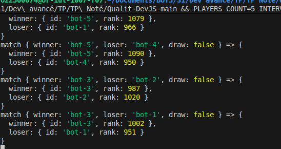
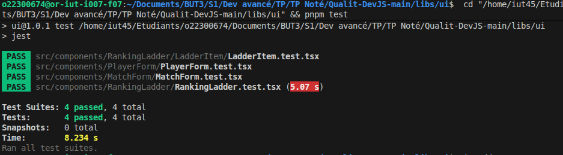

# Réponse au TD

Pour lancer mon application, veuillez lancer le fichier ./start-dev.sh

Le serveur Express expose des endpoints pour créer des joueurs, déclarer des matchs et suivre le classement en temps réel grâce à SSE, le tout stocké dans une base SQLite (fichier `data.db`). La librairie `libs/ui` fournit les composants `MatchForm`, `PlayerForm` et `RankingLadder`, qui gèrent les interactions côté client Next.js.

Le dossier `apps/realtime-elo-ranker-client` contient l'interface : les formulaires envoient leurs données à l'API et le classement est rafraîchi via les événements SSE. J'ai construit la librairie `libs/ui` avant de lancer le client (variable `NEXT_PUBLIC_API_BASE_URL=http://localhost:8080`) pour garantir que les styles et composants partagés soient disponibles.

Le simulateur (sous `simulate.js` et `run-with-simulate.js`) génère automatiquement des matchs, met à jour les classements en base et déclenche les événements SSE. Cette partie est documentée dans le README et fonctionne avec le serveur actif, comme on le voit sur la capture ci-dessous.

La vidéo de présentation montre la chaîne complète : génération automatique de matchs, réception du SSE sur le client et interface responsive.

[Visionner la vidéo du match automatique](medias/video_presentation_match_automatique.mp4)

Voici les tests que j'ai exécutés :

